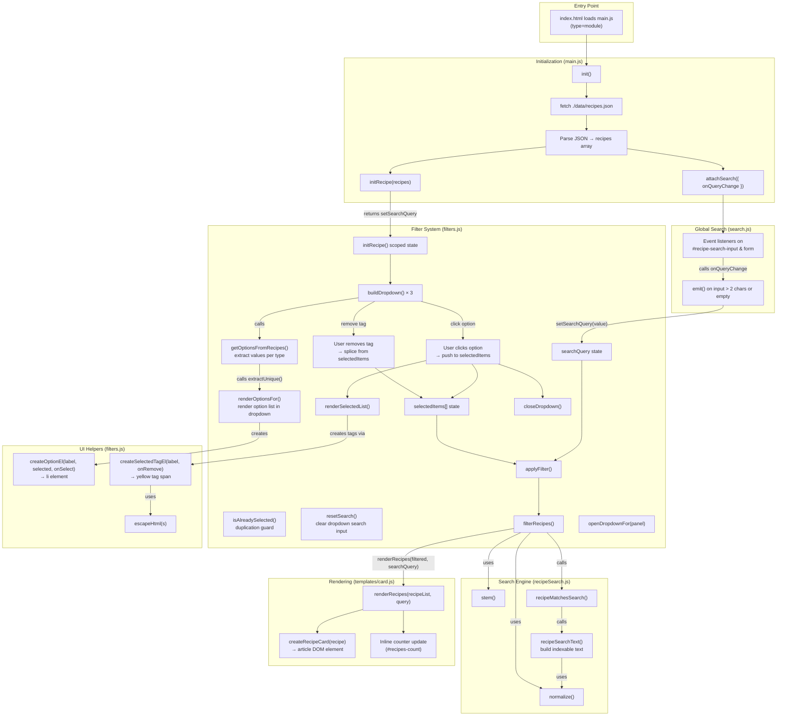
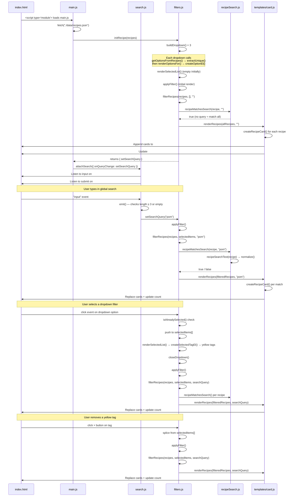
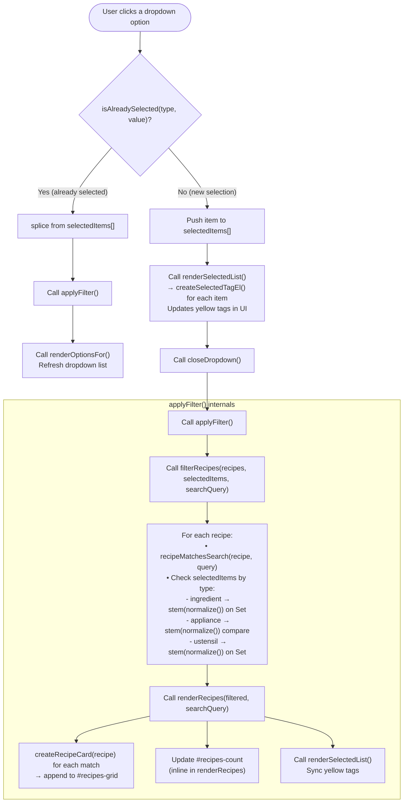
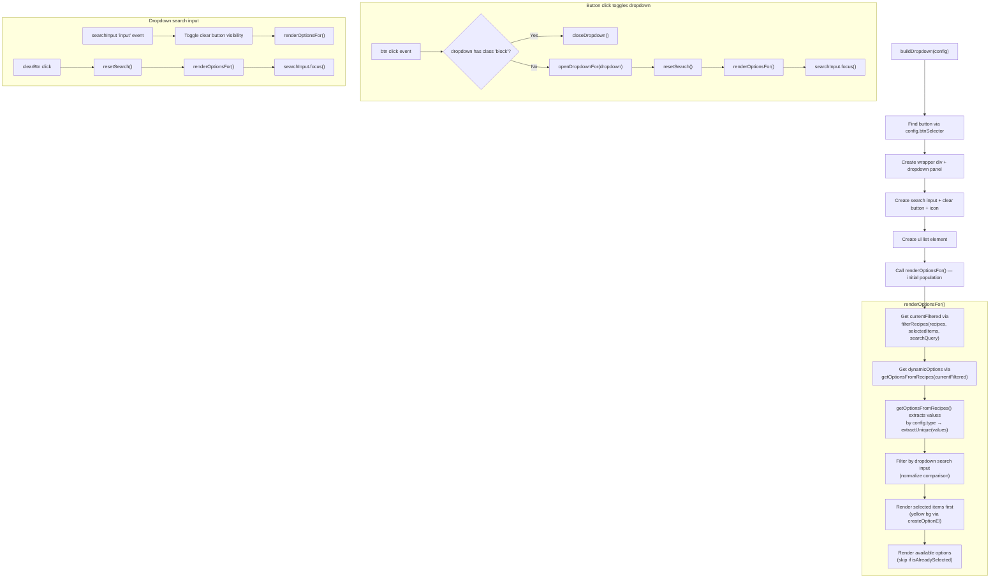
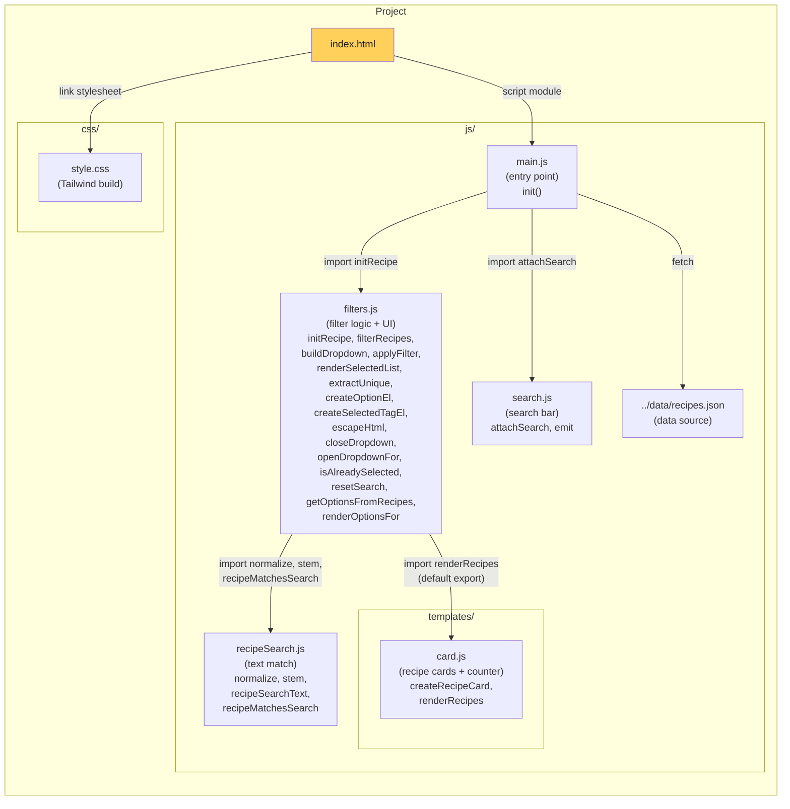

# Les Petits Plats — Architecture Diagram

## Project Overview

A vanilla JS recipe-search app. Users filter 1500+ recipes by **global search** (text), **ingredients**, **appliances**, and **ustensils** via dropdown filters and yellow tag chips. The UI updates in real time.

---

## High-Level Flow

### 📎 Function References

| Function | File | Line |
|---|---|---|
| [`init()`](./js/main.js#L4) | `main.js` | L4 |
| [`initRecipe()`](./js/filters.js#L77) | `filters.js` | L77 |
| [`extractUnique()`](./js/filters.js#L7) | `filters.js` | L7 |
| [`filterRecipes()`](./js/filters.js#L19) | `filters.js` | L19 |
| [`createOptionEl()`](./js/filters.js#L39) | `filters.js` | L39 |
| [`escapeHtml()`](./js/filters.js#L54) | `filters.js` | L54 |
| [`createSelectedTagEl()`](./js/filters.js#L61) | `filters.js` | L61 |
| [`applyFilter()`](./js/filters.js#L106) | `filters.js` | L106 |
| [`renderSelectedList()`](./js/filters.js#L113) | `filters.js` | L113 |
| [`closeDropdown()`](./js/filters.js#L125) | `filters.js` | L125 |
| [`openDropdownFor()`](./js/filters.js#L135) | `filters.js` | L135 |
| [`isAlreadySelected()`](./js/filters.js#L144) | `filters.js` | L144 |
| [`buildDropdown()`](./js/filters.js#L151) | `filters.js` | L151 |
| [`resetSearch()`](./js/filters.js#L195) | `filters.js` | L195 |
| [`getOptionsFromRecipes()`](./js/filters.js#L200) | `filters.js` | L200 |
| [`renderOptionsFor()`](./js/filters.js#L214) | `filters.js` | L214 |
| [`attachSearch()`](./js/search.js#L3) | `search.js` | L3 |
| [`emit()`](./js/search.js#L7) | `search.js` | L7 |
| [`normalize()`](./js/recipeSearch.js#L4) | `recipeSearch.js` | L4 |
| [`stem()`](./js/recipeSearch.js#L9) | `recipeSearch.js` | L9 |
| [`recipeSearchText()`](./js/recipeSearch.js#L17) | `recipeSearch.js` | L17 |
| [`recipeMatchesSearch()`](./js/recipeSearch.js#L27) | `recipeSearch.js` | L27 |
| [`createRecipeCard()`](./js/templates/card.js#L5) | `card.js` | L5 |
| [`renderRecipes()`](./js/templates/card.js#L93) | `card.js` | L93 |

---

## Data Flow Sequence

---

## Dropdown Selection Flow

This diagram details the specific sequence of events triggered when a user clicks on an option within one of the filter dropdowns (Ingredients, Appliances, or Ustensils).

---

## Dropdown Internal Flow

This diagram shows how a dropdown is built and how its internal search works.

---

## File Structure

### 📎 File References

| File | Path | Description |
|---|---|---|
| [index.html](./index.html) | `./index.html` | Main HTML page with DOM structure |
| [main.js](./js/main.js) | `./js/main.js` | Entry point — fetch + init |
| [search.js](./js/search.js) | `./js/search.js` | Global search event listeners |
| [recipeSearch.js](./js/recipeSearch.js) | `./js/recipeSearch.js` | Pure text search match logic |
| [filters.js](./js/filters.js) | `./js/filters.js` | Filter logic, dropdowns & tags |
| [card.js](./js/templates/card.js) | `./js/templates/card.js` | Recipe card factory + rendering + counter |
| [recipes.json](./data/recipes.json) | `./data/recipes.json` | Recipe data source |
| [style.css](./css/style.css) | `./css/style.css` | Tailwind CSS build |
