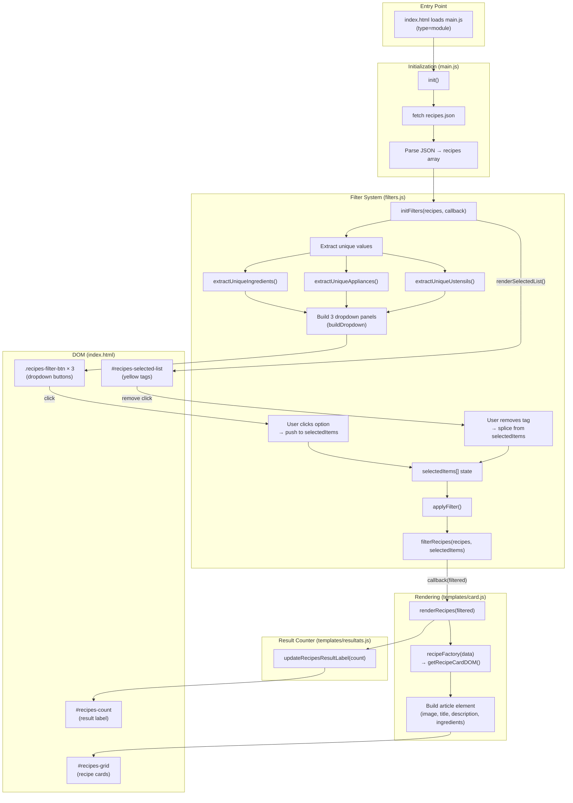
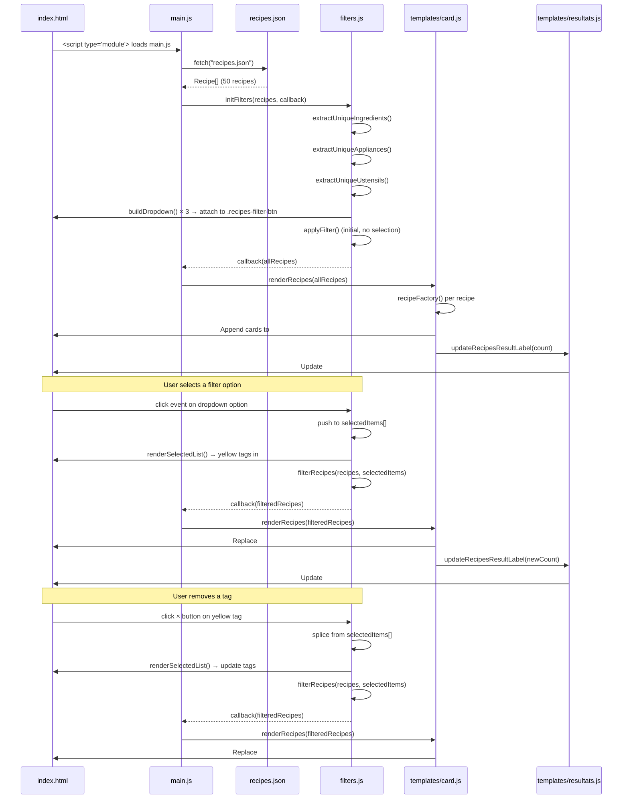
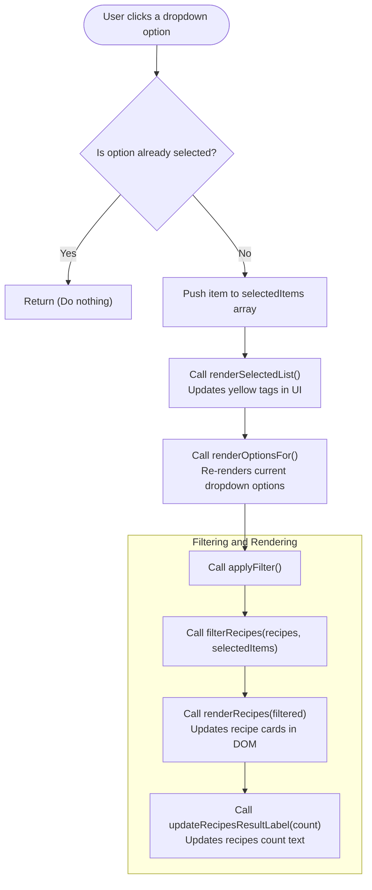
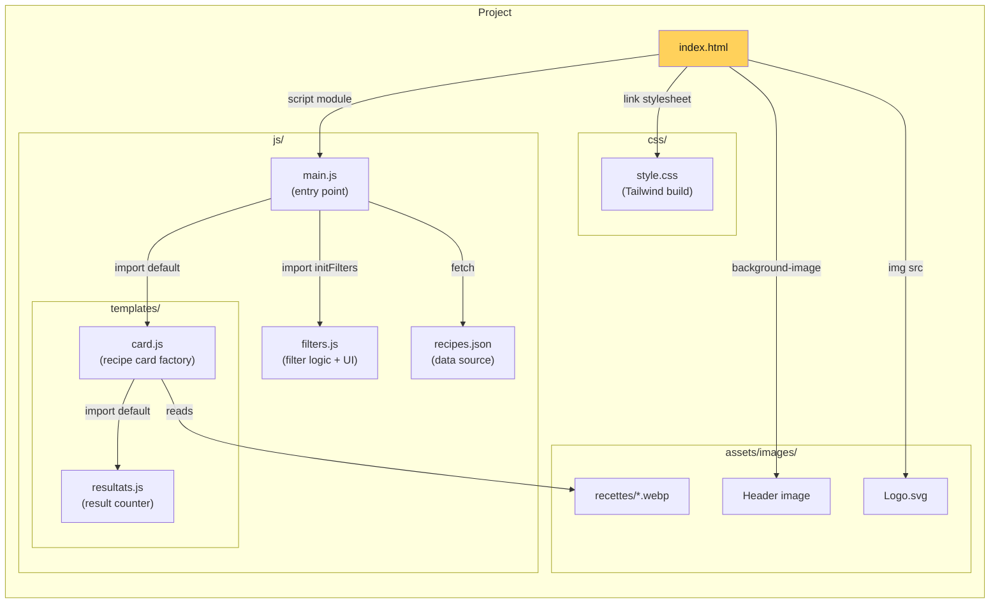

# Les Petits Plats — Architecture Diagram

## Project Overview

A vanilla JS recipe-search app. Users filter 1500+ recipes by **ingredients**, **appliances**, and **ustensils** via dropdown filters and yellow tag chips. The UI updates in real time.

---

## High-Level Flow

### 📎 Function References

| Function | File | Line |
|---|---|---|
| [`init()`](./js/main.js#L4) | `main.js` | L4 |
| [`initFilters()`](./js/filters.js#L121) | `filters.js` | L121 |
| [`extractUniqueIngredients()`](./js/filters.js#L13) | `filters.js` | L13 |
| [`extractUniqueAppliances()`](./js/filters.js#L30) | `filters.js` | L30 |
| [`extractUniqueUstensils()`](./js/filters.js#L45) | `filters.js` | L45 |
| [`filterRecipes()`](./js/filters.js#L62) | `filters.js` | L62 |
| [`buildDropdown()`](./js/filters.js#L205) | `filters.js` | L205 |
| [`applyFilter()`](./js/filters.js#L159) | `filters.js` | L159 |
| [`renderSelectedList()`](./js/filters.js#L165) | `filters.js` | L165 |
| [`createOptionEl()`](./js/filters.js#L84) | `filters.js` | L84 |
| [`createSelectedTagEl()`](./js/filters.js#L105) | `filters.js` | L105 |
| [`normalize()`](./js/filters.js#L8) | `filters.js` | L8 |
| [`renderRecipes()`](./js/templates/card.js#L123) | `card.js` | L123 |
| [`recipeFactory()`](./js/templates/card.js#L11) | `card.js` | L11 |
| [`updateRecipesResultLabel()`](./js/templates/resultats.js#L19) | `resultats.js` | L19 |

---

## Data Flow Sequence

---

## Dropdown Selection Flow

This diagram details the specific sequence of events triggered when a user clicks on an option within one of the filter dropdowns (Ingredients, Appliances, or Ustensils).

---

## File Structure

### 📎 File References

| File | Path | Description |
|---|---|---|
| [index.html](./index.html) | `./index.html` | Main HTML page with DOM structure |
| [main.js](./js/main.js) | `./js/main.js` | Entry point — fetch + init |
| [filters.js](./js/filters.js) | `./js/filters.js` | Filter logic, dropdowns & tags |
| [card.js](./js/templates/card.js) | `./js/templates/card.js` | Recipe card factory + rendering |
| [resultats.js](./js/templates/resultats.js) | `./js/templates/resultats.js` | Result counter update |
| [recipes.json](./js/recipes.json) | `./js/recipes.json` | Recipe data source |
| [style.css](./css/style.css) | `./css/style.css` | Tailwind CSS build |
