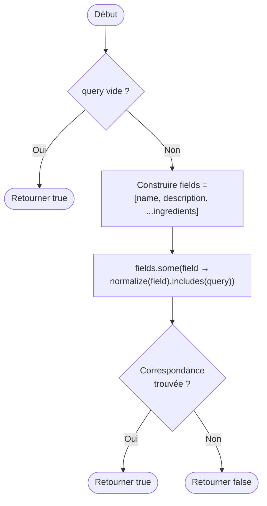

# Fiche d'investigation de fonctionnalité
## Fonctionnalité : Recherche principale de recettes

| Champ | Valeur |
|---|---|
| Fonctionnalité | Barre de recherche principale — filtrage des recettes |
| Cas d'utilisation | #03 – Filtrer les recettes dans l'interface utilisateur |
| Référence Mockup | #003 |
| Responsable | Jean-Baptiste A. |
| Version | 1.0 |
| Date | 2026-03-29 |

---

## Description de la fonctionnalité

L'utilisateur saisit un mot ou groupe de lettres dans la barre de recherche principale. À partir de 3 caractères, le système filtre en temps réel les recettes dont le **nom**, les **ingrédients** ou la **description** contiennent la saisie. Les résultats s'actualisent à chaque nouveau caractère.

Le cœur de l'algorithme est donc : *pour chaque recette du tableau, déterminer si elle correspond à la requête saisie*.

---

## Proposition 1 — Boucles natives (`for`)

### Description

Cette implémentation parcourt explicitement chaque champ de la recette avec une boucle `for` classique. Dès qu'une correspondance est trouvée dans l'un des champs, la fonction retourne `true` immédiatement (**court-circuit explicite**) sans inspecter les champs restants.

**Pseudocode :**

```
function recipeMatchesSearch(recipe, normalizedQuery):
  if normalizedQuery est vide → retourner true

  if normalize(recipe.name) contient normalizedQuery → retourner true
  if normalize(recipe.description) contient normalizedQuery → retourner true

  pour i de 0 à recipe.ingredients.length - 1:
    si normalize(recipe.ingredients[i].ingredient) contient normalizedQuery:
      retourner true

  retourner false
```

**Caractéristiques :**
- Pas d'allocation de tableau intermédiaire
- Sortie anticipée dès la première correspondance
- Lisibilité impérative proche du pseudocode

### Algorigramme

```mermaid
flowchart TD
    A([Début]) --> B{query vide ?}
    B -- Oui --> C([Retourner true])
    B -- Non --> D{name contient query ?}
    D -- Oui --> C
    D -- Non --> E{description contient query ?}
    E -- Oui --> C
    E -- Non --> F[i = 0]
    F --> G{i < ingredients.length ?}
    G -- Non --> H([Retourner false])
    G -- Oui --> I{ingredients\[i\] contient query ?}
    I -- Oui --> C
    I -- Non --> J[i++]
    J --> G
```

---

## Proposition 2 — Programmation fonctionnelle (`Array.some`)

### Description

Cette implémentation construit d'abord un tableau de tous les champs à inspecter (nom, description, ingrédients) en utilisant le spread operator et `Array.map`, puis appelle `Array.some` qui itère jusqu'à trouver la première correspondance (**court-circuit natif**).

**Pseudocode :**

```
function recipeMatchesSearch(recipe, normalizedQuery):
  if normalizedQuery est vide → retourner true

  fields = [
    recipe.name,
    recipe.description,
    ...recipe.ingredients.map(i → i.ingredient)
  ]

  retourner fields.some(field → normalize(field) contient normalizedQuery)
```

**Caractéristiques :**
- Style déclaratif, expressif et concis
- Court-circuit intégré à `.some()`
- Allocation d'un tableau intermédiaire `fields` à chaque appel
- Usage des méthodes natives de l'objet Array

### Algorigramme



---

## Comparaison prévisionnelle

| Critère | Proposition 1 — Boucles natives | Proposition 2 — Fonctionnelle |
|---|---|---|
| Lisibilité | Impérative, proche du pseudocode | Déclarative, concise |
| Allocation mémoire | Aucune (pas de tableau intermédiaire) | 1 tableau `fields` par appel |
| Court-circuit | Manuel (return anticipé) | Natif (`.some()`) |
| Maintenabilité | Légèrement plus verbeux | Plus facile à lire et modifier |
| Performance estimée | Potentiellement plus rapide | Légèrement pénalisé par l'allocation |

---

## Résultats des tests de performance

Tests réalisés sur [Jsben.ch](https://jsben.ch) avec un dataset de 5 recettes représentatives et la requête `"tomate"`.

| Implémentation | Opérations / seconde | Écart relatif |
|---|---|---|
| Proposition 1 — Boucles natives | 1 210 000 ops/sec (±2.68%) | **+38%** 🏆 |
| Proposition 2 — Fonctionnelle | 874 260 ops/sec (±4.45%) | référence |

**Conditions du test :**
- Dataset : 5 recettes représentatives
- Requête testée : `"tomate"` (correspond à plusieurs recettes)
- Outil : Jsben.ch
- Date du test : 2026-03-29

**Analyse :**
La version boucles natives est 38% plus rapide. L'écart s'explique principalement par l'allocation d'un tableau intermédiaire `fields` à chaque appel dans la version fonctionnelle (spread operator + `Array.map`), opération coûteuse en mémoire qui n'existe pas dans la version boucles natives. De plus, la version boucles natives effectue un retour anticipé dès le premier champ correspondant (nom ou description), sans construire la liste des ingrédients si ce n'est pas nécessaire.

---

## Recommandation

**Algorithme retenu : Proposition 1 — Boucles natives (`for`)**

Les tests de performance montrent que la version boucles natives est **38% plus rapide** que la version fonctionnelle. Cette différence est significative dans le contexte d'une recherche en temps réel qui s'actualise à chaque frappe clavier : moins d'opérations par seconde signifie une interface moins réactive, en particulier sur des appareils moins puissants.

La version boucles natives présente deux avantages décisifs :
1. **Pas d'allocation mémoire intermédiaire** — aucun tableau `fields` créé à chaque appel
2. **Court-circuit explicite et immédiat** — retour dès le premier champ correspondant, sans traiter les ingrédients si le nom ou la description suffit

La version fonctionnelle reste plus lisible et maintenable, mais la règle de gestion n°4 du cas d'utilisation impose que *"la recherche principale affiche les premiers résultats le plus rapidement possible"*, ce qui tranche en faveur des boucles natives.

---

*Fiche rédigée dans le cadre du Projet P7 — OpenClassroom — Développeur JavaScript React*
